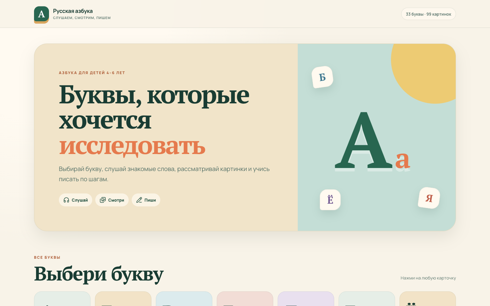
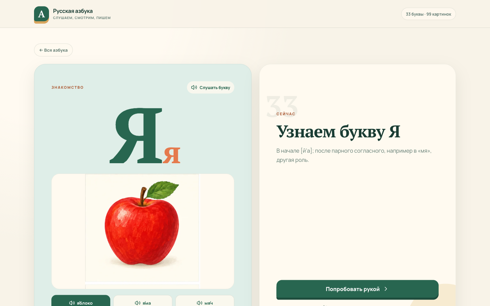
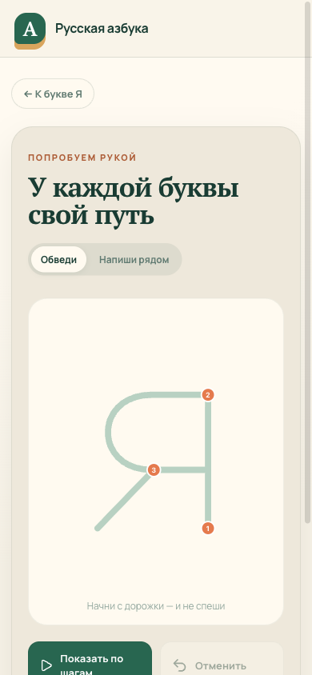

# Russian Alphabet for Kids

An interactive Russian alphabet for children aged 4–6. This family pet project helps children learn all 33 letters quickly through short, friendly activities: listen to a letter, explore three familiar words, switch between hand-painted illustrations, and practise writing each letter stroke by stroke.

**[Open the live app →](https://koryashkin.github.io/russian-alphabet/)**



## What children can do

- Open any of the 33 Russian letters from the alphabet screen.
- Hear letters and words through the browser speech engine.
- Explore three words and three matching illustrations for every letter — 99 images in total.
- Watch a print-letter model stroke by stroke and draw with a finger or Apple Pencil.
- Play three rounds with Е: find whether it is at the beginning, in the middle, or at the end of a word.
- Use the app on a phone, tablet, or desktop without an account.



<p align="center"></p>

## Why this project exists

I built this project for my child and for other families who want a calm, visual introduction to the Russian alphabet. The interface keeps each activity short and clear so a child can make progress in a few minutes without navigating complicated menus. Adults should still review pronunciation, stress marks, and word meaning together with the child.

## Development and quality

The app is a static React and TypeScript site built with Vite. Illustrations are stored as optimized WebP assets; letters and labels remain HTML so the generated artwork cannot introduce an incorrect glyph. Writing guides use printed capital letters rather than cursive. GitHub Actions runs linting, content tests, a production build, and Playwright browser tests for desktop and mobile before deploying to GitHub Pages. The browser suite opens all 33 cards and writing guides, decodes all 99 images, checks word switching, tracing controls, the Е game, responsive layout, and the sound-help fallback.

```bash
npm install
npm run dev
npm run test:all
```

Project documentation:

- [Learning programme and implementation plan](docs/program-and-implementation-plan.md)
- [MVP development plan and technical architecture](docs/mvp-development-plan.md)
- [Illustration generation and style guide](docs/asset-generation.md)

---

# Русская азбука для детей

Интерактивная русская азбука для детей 4–6 лет. Это семейный pet project, который помогает быстрее выучить все 33 буквы через короткие и понятные занятия: послушать букву, познакомиться с тремя словами, рассмотреть отдельные иллюстрации и потренироваться писать по шагам.

**[Открыть приложение →](https://koryashkin.github.io/russian-alphabet/)**

## Что умеет азбука

- Все 33 буквы доступны с первого экрана.
- Буквы и слова озвучиваются средствами браузера.
- Для каждой буквы есть три слова и три подходящие картинки — всего 99 иллюстраций.
- Печатное написание показывается по штрихам; рисовать можно пальцем или Apple Pencil.
- Для буквы Е есть три раунда: нужно определить, где она стоит в слове — в начале, в середине или в конце.
- Приложение работает на телефоне, планшете и компьютере без регистрации.

## Для чего создан проект

Я сделал эту азбуку для своего ребёнка и для других семей, которым нужен спокойный и наглядный способ познакомиться с русскими буквами. Каждый экран посвящён одному простому действию, поэтому ребёнок может заниматься несколько минут без сложных меню. Произношение, ударения и значение слов лучше обсуждать вместе со взрослым.

## Разработка и проверка

Это статическое приложение на React, TypeScript и Vite. Иллюстрации оптимизированы в WebP, а буквы и подписи выводятся через HTML, чтобы генерация изображения не могла исказить букву. В прописях используются печатные заглавные буквы, а не курсив. Перед публикацией GitHub Actions запускает линтер, проверку учебных данных, production-сборку и Playwright-тесты в мобильном и настольном режимах. Браузерные тесты проходят все 33 карточки и трафарета, декодируют все 99 изображений, проверяют переключение слов, рисование, показ штрихов, игру с Е, адаптивность и помощь со звуком. После успешной проверки сайт автоматически публикуется на GitHub Pages.

Документация проекта:

- [Педагогическая программа и полный план реализации](docs/program-and-implementation-plan.md)
- [План разработки MVP и техническая архитектура](docs/mvp-development-plan.md)
- [Правила генерации и единый стиль иллюстраций](docs/asset-generation.md)
